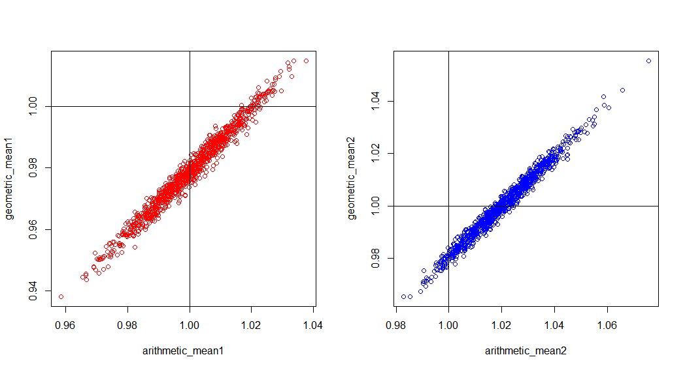
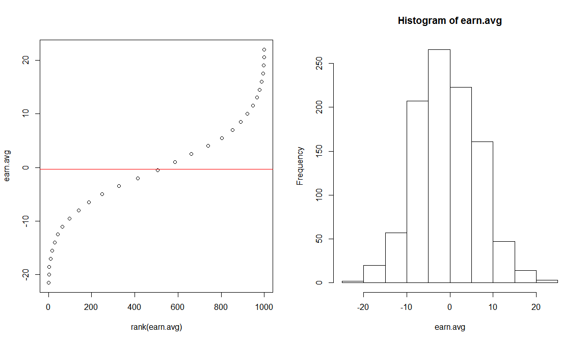

# [My R Modules](../README.md#my-r-modules)

### \<List>

- [Arithmetic Mean vs Geometrical Mean (2022.12.29)](#arithmetic-mean-vs-geometrical-mean-20221229)


## [Arithmetic Mean vs Geometrical Mean (2022.12.29)](#list)

- Generally, the geometrical mean tends to be lower than the arithmetic mean.

  

  <details>
    <summary>Codes : Mean.r</summary>

  ```r
  # Set the number of simulations
  n_simulations <- 1000

  # Set the sample size
  sample_size <- 240

  # Set the distribution of values for the random sample
  mean = 1
  sd = 0.3
  ```
  ```r
  # Initialize vectors to store the results of the simulations
  arithmetic_mean1 <- numeric(n_simulations)
  arithmetic_mean2 <- numeric(n_simulations)
  geometric_mean1 <- numeric(n_simulations)
  geometric_mean2 <- numeric(n_simulations)

  # Run the simulations
  for (i in 1:n_simulations) {
      # Generate a random sample
      sample1 <- rnorm(sample_size, mean = mean, sd = sd)
      sample2 <- rlnorm(sample_size, mean = log(mean), sd = sd)

      # Calculate the arithmetic mean of the sample
      arithmetic_mean1[i] <- mean(sample1)
      arithmetic_mean2[i] <- mean(sample2)

      # Calculate the geometric mean of the sample
      geometric_mean1[i] <- exp(mean(log(sample1)))
      geometric_mean2[i] <- exp(mean(log(sample2)))
  }
  ```
  ```r
  # Calculate the mean and standard deviation of the arithmetic means
  arithmetic_mean_mean1 <- mean(arithmetic_mean1)
  arithmetic_mean_mean2 <- mean(arithmetic_mean2)
  arithmetic_mean_sd1 <- sd(arithmetic_mean1)
  arithmetic_mean_sd2 <- sd(arithmetic_mean2)

  # Calculate the mean and standard deviation of the geometric means
  geometric_mean_mean1 <- mean(geometric_mean1)
  geometric_mean_mean2 <- mean(geometric_mean2)
  geometric_mean_sd1 <- sd(geometric_mean1)
  geometric_mean_sd2 <- sd(geometric_mean2)

  # Print the results
  print(paste("Arithmetic mean 1:", arithmetic_mean_mean1, "±", arithmetic_mean_sd1))
  print(paste("Geometric mean 1:", geometric_mean_mean1, "±", geometric_mean_sd1))
  print(paste("Arithmetic mean 2:", arithmetic_mean_mean2, "±", arithmetic_mean_sd2))
  print(paste("Geometric mean 2:", geometric_mean_mean2, "±", geometric_mean_sd2))
  ```
  ```r
  # Plot
  windows(width = 11, height = 6,
          title = "Arithmetic Mean vs Geometric Mean")                            # title argument does not work
  par(mfrow = c(1, 2))
  plot(arithmetic_mean1, geometric_mean1,
      # xlim = c(0.99, 1.01), ylim = c(0.99, 1.01),
      col = "red")
  abline(h = 1); abline(v = 1)
  plot(arithmetic_mean2, geometric_mean2,
      # xlim = c(0.99, 1.01), ylim = c(0.99, 1.01),
      col = "blue")
  abline(h = 1); abline(v = 1)
  ```
  </details>

  ```
  [1] "Arithmetic mean 1: 0.999924804528105 ± 0.0128838398954078"
  [1] "Geometric mean 1: 0.978778509142553 ± 0.0132069503869906"
  [1] "Arithmetic mean 2: 1.0204070827279 ± 0.0131895453967714"
  [1] "Geometric mean 2: 1.00029970882788 ± 0.0128234253639529"
  ```

## [Monte Carlo Simulation (2018.03.28)](#list)

- Suppose a Binomial dist., n=100, p=0.3333 / win -> +100, lose -> -50 / run 1,000 times
- It seems …… useless???

  

  <details>
    <summary>Codes : Monte_Carlo_Simulation_20180328.R</summary>

  ```R
  m <- 1000; n <- 100; p <- 0.3333
  win <- 100; lose <- -50
  binom.raw <- matrix(nrow=m, ncol=n)
  earn <- matrix(nrow=m, ncol=n)
  earn.avg <-c()

  for (i in 1:m) {
    binom.raw[i,] <- rbinom(n, 1, p)
    for (j in 1:n ) {
      ifelse(binom.raw[i,j] == 1, earn[i,j] <- win, earn[i,j] <- lose)
    }
    earn.avg[i] <- mean(earn[i,])
  }

  summary(earn.avg)

  windows(width=12, height=7)
  par(mfrow=c(1,2)) 
    plot(rank(earn.avg),earn.avg)
      abline(h=mean(earn.avg), col="red")
    hist(earn.avg)
  ```
  </details>
