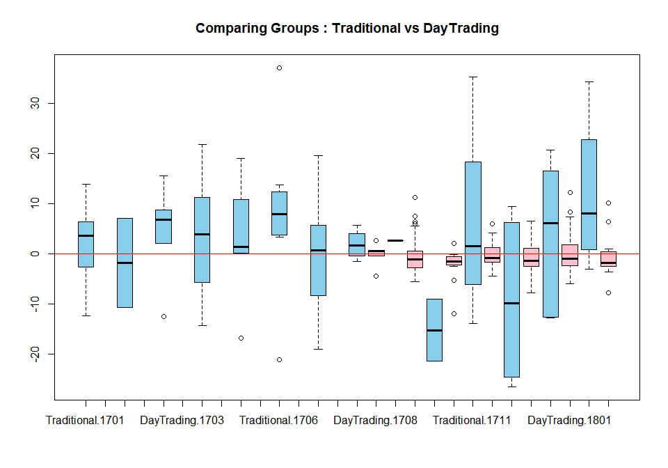
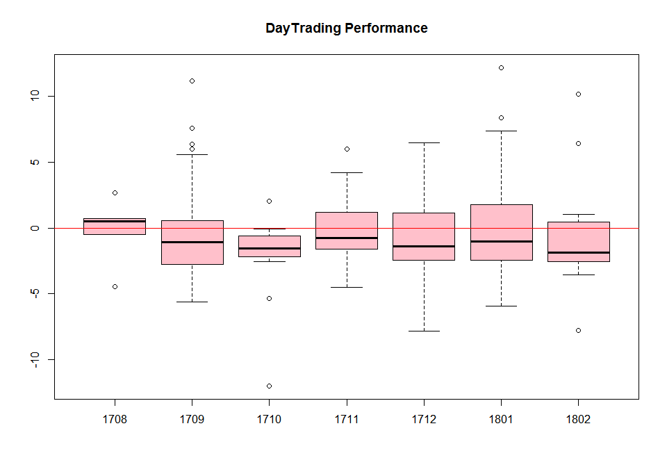

# [My R Modules](../README.md#my-r-modules)


### \<List>

- [Download Stock Price Data with `tidyquant` (2023.06.18)](#download-stock-price-data-with-tidyquant-20230618)
- [Arithmetic Mean vs Geometrical Mean 2 (2023.01.24)](#arithmetic-mean-vs-geometrical-mean-2-20230124)
- [Arithmetic Mean vs Geometrical Mean (2022.12.29)](#arithmetic-mean-vs-geometrical-mean-20221229)
- [Monte Carlo Simulation (2018.03.28)](#monte-carlo-simulation-20180328)
- [Boxplot (2018.01.11)](#boxplot-20180111)


## [Download Stock Price Data with `tidyquant` (2023.06.18)](#list)

- Download daily stock price data into a `.csv` file  
  - 8 columns : `symbol` `date` `open` `high` `low` `close` `volume` `adjusted`

  <br><details>
    <summary>Codes : TidyquantInit.r</summary>

  ```r
  # 필요한 라이브러리를 로드합니다
  if (!requireNamespace("tidyquant")) {
      install.packages("tidyquant")
  }
  library(tidyquant)

  # 작업 디렉토리를 설정합니다. 해당 경로에 저장될 것입니다.
  setwd({path})

  # 다운로드 받을 종목의 심볼을 정의합니다
  symbols <- c("122630.KS", "252670.KS")  # KODEX 레버리지, KODEX 200선물인버스2X

  # 데이터를 다운로드할 기간을 설정합니다
  start_date <- "2022-01-01"
  end_date <- "2022-12-31"

  # 종목 데이터를 다운로드합니다
  data <- tq_get(symbols, from = start_date, to = end_date)
  head(data)
  str(data)

  # 데이터프레임을 CSV 파일로 저장합니다
  current_datetime <- format(Sys.time(), "%Y%m%d_%H%M%S")
  write.csv(data, file = paste0("stock_data_", current_datetime, ".csv"))
  ```
  </details>
  <details open="">
    <summary>Output</summary>

  ```text
  # A tibble: 6 x 8
    symbol    date        open  high   low close   volume adjusted
    <chr>     <date>     <dbl> <dbl> <dbl> <dbl>    <dbl>    <dbl>
  1 122630.KS 2022-01-04 24030 24120 23700 23945 14785180    23945
  2 122630.KS 2022-01-05 23820 23885 23005 23265 18355770    23265
  3 122630.KS 2022-01-06 22920 23370 22800 22850 21266580    22850
  4 122630.KS 2022-01-07 23120 23475 23035 23380 14437010    23380
  5 122630.KS 2022-01-10 23295 23335 22670 22985 16135230    22985
  6 122630.KS 2022-01-11 23090 23345 22885 23135 15460780    23135
  ```
  ```text
  tibble [488 x 8] (S3: tbl_df/tbl/data.frame)
  $ symbol  : chr [1:488] "122630.KS" "122630.KS" "122630.KS" "122630.KS" ...
  $ date    : Date[1:488], format: "2022-01-04" "2022-01-05" "2022-01-06" "2022-01-07" ...
  $ open    : num [1:488] 24030 23820 22920 23120 23295 ...
  $ high    : num [1:488] 24120 23885 23370 23475 23335 ...
  $ low     : num [1:488] 23700 23005 22800 23035 22670 ...
  $ close   : num [1:488] 23945 23265 22850 23380 22985 ...
  $ volume  : num [1:488] 14785180 18355770 21266580 14437010 16135230 ...
  $ adjusted: num [1:488] 23945 23265 22850 23380 22985 ...
  ```
  </details>

## [Arithmetic Mean vs Geometrical Mean 2 (2023.01.24)](#list)

- Although testing some extreme cases, it seems **never** be able for the *geometrical mean* to beat the *arithmetic mean*.

  

  <details>
    <summary>Codes : Mean2.r</summary>

  ```r
  # Case 1

  case1 <- c(seq(1, 1.2, by=0.01), seq(1, 0.8, by=-0.01))
  # case1 <- seq(1.2, 0.8, by=-0.01)
  plot(case1)
  abline(h = 1)

  aMean <- mean(case1)
  gMean <- exp(mean(log(case1)))

  print(paste("Arithmetic mean:", aMean))
  print(paste("Geometric mean:", gMean))
  ```
  ```r
  # Case 2

  case2 <- c(2, 0.5)
  aMean <- mean(case2)
  gMean <- exp(mean(log(case2)))

  print(paste("Arithmetic mean:", aMean))
  print(paste("Geometric mean:", gMean))
  ```
  </details>

  ```
  # Case 1
  [1] "Arithmetic mean: 1"
  [1] "Geometric mean: 0.993102769755157"

  # Case 2
  [1] "Arithmetic mean: 1.25"
  [1] "Geometric mean: 1"
  ```

- Stop …… did you forget this formula? Don't disappoint your primary school!
  ```
  (a + b) / 2 ≥ sqrt(a · b)
  ```


## [Arithmetic Mean vs Geometrical Mean (2022.12.29)](#list)

- Generally, the geometrical mean tends to be lower than the arithmetic mean.

  

  <details>
    <summary>Codes : Mean.r</summary>

  ```r
  # Set the number of simulations
  n_simulations <- 1000

  # Set the sample size
  sample_size <- 240

  # Set the distribution of values for the random sample
  mean = 1
  sd = 0.3
  ```
  ```r
  # Initialize vectors to store the results of the simulations
  arithmetic_mean1 <- numeric(n_simulations)
  arithmetic_mean2 <- numeric(n_simulations)
  geometric_mean1 <- numeric(n_simulations)
  geometric_mean2 <- numeric(n_simulations)

  # Run the simulations
  for (i in 1:n_simulations) {
      # Generate a random sample
      sample1 <- rnorm(sample_size, mean = mean, sd = sd)
      sample2 <- rlnorm(sample_size, mean = log(mean), sd = sd)

      # Calculate the arithmetic mean of the sample
      arithmetic_mean1[i] <- mean(sample1)
      arithmetic_mean2[i] <- mean(sample2)

      # Calculate the geometric mean of the sample
      geometric_mean1[i] <- exp(mean(log(sample1)))
      geometric_mean2[i] <- exp(mean(log(sample2)))
  }
  ```
  ```r
  # Calculate the mean and standard deviation of the arithmetic means
  arithmetic_mean_mean1 <- mean(arithmetic_mean1)
  arithmetic_mean_mean2 <- mean(arithmetic_mean2)
  arithmetic_mean_sd1 <- sd(arithmetic_mean1)
  arithmetic_mean_sd2 <- sd(arithmetic_mean2)

  # Calculate the mean and standard deviation of the geometric means
  geometric_mean_mean1 <- mean(geometric_mean1)
  geometric_mean_mean2 <- mean(geometric_mean2)
  geometric_mean_sd1 <- sd(geometric_mean1)
  geometric_mean_sd2 <- sd(geometric_mean2)

  # Print the results
  print(paste("Arithmetic mean 1:", arithmetic_mean_mean1, "±", arithmetic_mean_sd1))
  print(paste("Geometric mean 1:", geometric_mean_mean1, "±", geometric_mean_sd1))
  print(paste("Arithmetic mean 2:", arithmetic_mean_mean2, "±", arithmetic_mean_sd2))
  print(paste("Geometric mean 2:", geometric_mean_mean2, "±", geometric_mean_sd2))
  ```
  ```r
  # Plot
  windows(width = 11, height = 6,
          title = "Arithmetic Mean vs Geometric Mean")                            # title argument does not work
  par(mfrow = c(1, 2))
  plot(arithmetic_mean1, geometric_mean1,
      # xlim = c(0.99, 1.01), ylim = c(0.99, 1.01),
      col = "red")
  abline(h = 1); abline(v = 1)
  plot(arithmetic_mean2, geometric_mean2,
      # xlim = c(0.99, 1.01), ylim = c(0.99, 1.01),
      col = "blue")
  abline(h = 1); abline(v = 1)
  ```
  </details>

  ```
  [1] "Arithmetic mean 1: 0.999924804528105 ± 0.0128838398954078"
  [1] "Geometric mean 1: 0.978778509142553 ± 0.0132069503869906"
  [1] "Arithmetic mean 2: 1.0204070827279 ± 0.0131895453967714"
  [1] "Geometric mean 2: 1.00029970882788 ± 0.0128234253639529"
  ```

## [Monte Carlo Simulation (2018.03.28)](#list)

- Suppose a Binomial dist., n=100, p=0.3333 / win -> +100, lose -> -50 / run 1,000 times
- It seems …… useless???

  

  <details>
    <summary>Codes : Monte_Carlo_Simulation.R</summary>

  ```R
  m <- 1000; n <- 100; p <- 0.3333
  win <- 100; lose <- -50
  binom.raw <- matrix(nrow=m, ncol=n)
  earn <- matrix(nrow=m, ncol=n)
  earn.avg <-c()

  for (i in 1:m) {
    binom.raw[i,] <- rbinom(n, 1, p)
    for (j in 1:n ) {
      ifelse(binom.raw[i,j] == 1, earn[i,j] <- win, earn[i,j] <- lose)
    }
    earn.avg[i] <- mean(earn[i,])
  }

  summary(earn.avg)

  windows(width=12, height=7)
  par(mfrow=c(1,2)) 
    plot(rank(earn.avg),earn.avg)
      abline(h=mean(earn.avg), col="red")
    hist(earn.avg)
  ```
  </details>


# [Boxplot (2018.01.11)](#list)

- Drawing boxplots divided by groups and months for monitoring multi-strategy investment performance

    
    
  

  <details>
    <summary>Codes : Boxplot.R</summary>

  ```r
  ## Set working directory (not necessary)
  setwd(""~/your path"")

  ## Generating file & dataframe names by each month
  ## Target Period : '17.1 ~ '18.01
  file.yymm <- c(1701:1712, 1801:1802)
  file.name <- sprintf('stock_history_%s.csv', file.yymm)
  df.name <- sprintf('stk.history.%s', file.yymm)

  ## Making dataframes by each month data
  for (i in 1:length(file.yymm)) {
    assign(df.name[i], read.csv(file.name[i], header=T))
    print(sprintf('stk.history.%s', file.yymm[i]))
  }

  ## Merging mothly data
  ## These ugly codes should be upgraded!
  stk.history <- c()
  for (i in 1:length(file.yymm)) {
    stk.history <- rbind(stk.history.1701,
                        stk.history.1702,
                        stk.history.1703,
                        stk.history.1704,
                        stk.history.1705,
                        stk.history.1706,
                        stk.history.1707,
                        stk.history.1708,
                        stk.history.1709,
                        stk.history.1710,
                        stk.history.1711,
                        stk.history.1712,
                        stk.history.1801,
                        stk.history.1802)
  }

  ## Checking the structure of the merged dataframe
  str(stk.history)


  attach(stk.history)

  ## Boxplot 1
  windows(width=10, height=7)
  boxplot(수익률 ~ YYMM, main="Monthly Performace (Total)")
  abline(h=0, col='red')

  ## Boxplot 2
  windows(width=10, height=7)
  boxplot(수익률 ~ 그룹 + YYMM, 
            main="Comparing Groups : Traditional vs DayTrading",
            col=c('skyblue','pink'))
  abline(h=0, col='red')

  ## Boxplot 3
  windows(width=10, height=7)
  boxplot(수익률 ~ YYMM, subset=그룹=='DayTrading',
            main="DayTrading Performance", col=c('pink'))
  abline(h=0, col='red')

  detach(stk.history)
  ```
  </details>