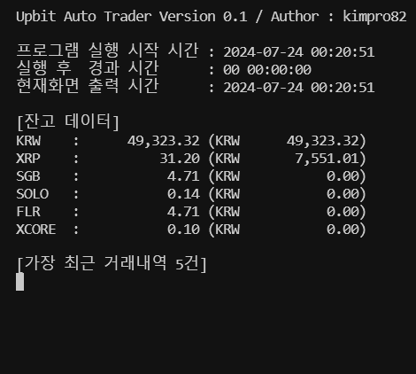

# [My `Upbit Open API` Application Modules](../README.md#my-upbit-open-api-application-modules)

### \<Reference>
- [Documentation] 업비트 개발자 센터 ☞ https://docs.upbit.com/
- [Github] sharebook-kr/pyupbit ☞ https://github.com/sharebook-kr/pyupbit
- [Wikidocs] 암호화폐 자동매매를 위한 파이썬과 CCXT ☞ https://wikidocs.net/book/8616

### \<List>
- [Simple Trading Program v0.1.1 (2024.07.25)](#simple-trading-program-v011-20240725)
- [Simple Trading Program v0.1 (2024.07.23)](#simple-trading-program-v01-20240723)
- [Init. (2023.04.27)](#init-20230427)


## [Simple Trading Program v0.1.1 (2024.07.25)](#list)

- Refactoring : Function Decomposition and Hierarchization
  ```txt
  main
  │
  ├── generate_jwt_token
  │
  ├── fetch_market_data
  ├── fetch_top_traded_ticker
  ├── fetch_balances
  ├── fetch_orders
  │
  ├── buy_order
  ├── sell_order
  ├── trade_logic
  │   ├── calculate_top_ticker_balance
  │   ├── perform_buy_logic
  │   └── perform_sell_logic
  │
  └── print_console
      ├── format_elapsed_time
      ├── generate_console_basic_output
      ├── generate_balances_output
      └── generate_orders_output
  ```
  - The execution results displayed on the console remain unchanged from [the previous version *0.1*](#simple-trading-program-v01-20240723).
- Mainly changed code : simple_system_0_1_1.py (partial)
  <details>
    <summary>trade_logic()</summary>

    ```py
    async def trade_logic(session):
        """
        매수 및 매도 로직을 수행합니다.
        - 거래대금 1위 종목의 잔고 비율이 49% 미만일 경우 매수
        - 거래대금 1위 종목이 아닌 종목의 잔고나 1위 종목의 잔고 비율이 51%를 초과할 경우 매도
        
        Args:
            session (aiohttp.ClientSession): 비동기 HTTP 요청을 위한 세션
        """

        async def calculate_top_ticker_balance(balances, top_ticker):
            ……

        async def perform_buy_logic(top_ticker, total_balance_krw, top_ticker_balance_value, top_ticker_ratio):
            ……

        async def perform_sell_logic(balances, top_ticker, total_balance_krw, top_ticker_ratio):
            ……

        balances = await fetch_balances(session)
        top_ticker = await fetch_top_traded_ticker(session)
        total_balance_krw, top_ticker_balance_value, top_ticker_ratio = await calculate_top_ticker_balance(balances, top_ticker)
        await perform_buy_logic(top_ticker, total_balance_krw, top_ticker_balance_value, top_ticker_ratio)
        await perform_sell_logic(balances, top_ticker, total_balance_krw, top_ticker_ratio)
    ```
  </details>
  <details>
    <summary>trade_logic() > calculate_top_ticker_balance()</summary>

    ```py
    async def trade_logic(session):
        ……

        async def calculate_top_ticker_balance(balances, top_ticker):
            """
            거래대금 1위 종목의 잔고 비율을 계산합니다.
            
            Args:
                balances (list): 계좌 잔고 정보
                top_ticker (dict): 거래대금 1위 종목의 시세 정보
            
            Returns:
                tuple: 총 원화 잔고, 거래대금 1위 종목의 잔고 가치, 거래대금 1위 종목의 잔고 비율
            """
            total_balance_krw = sum(
                float(balance['balance']) * float(balance['avg_buy_price']) if balance['currency'] != 'KRW' else float(balance['balance'])
                for balance in balances
            )
            top_ticker_balance = next(
                (balance for balance in balances if balance['currency'] == top_ticker['market'].split('-')[1]), None
            )
            if top_ticker_balance:
                top_ticker_balance_value = float(top_ticker_balance['balance']) * float(top_ticker['trade_price'])
                top_ticker_ratio = top_ticker_balance_value / total_balance_krw
            else:
                top_ticker_balance_value = 0
                top_ticker_ratio = 0

            return total_balance_krw, top_ticker_balance_value, top_ticker_ratio

        ……
    ```
  </details>
  <details>
    <summary>trade_logic() > perform_buy_logic()</summary>

    ```py
    async def trade_logic(session):
        ……

        async def perform_buy_logic(top_ticker, total_balance_krw, top_ticker_balance_value, top_ticker_ratio):
            """
            매수 로직을 수행합니다.
            
            Args:
                top_ticker (dict): 거래대금 1위 종목의 시세 정보
                total_balance_krw (float): 총 원화 잔고
                top_ticker_balance_value (float): 거래대금 1위 종목의 잔고 가치
                top_ticker_ratio (float): 거래대금 1위 종목의 잔고 비율
            """
            if top_ticker_ratio < 0.49:
                buy_amount_krw = total_balance_krw * 0.50 - top_ticker_balance_value
                buy_price = float(top_ticker['trade_price'])
                buy_volume = buy_amount_krw / buy_price
                await buy_order(session, top_ticker['market'], buy_price, buy_volume)

        ……
    ```
  </details>
  <details>
    <summary>trade_logic() > perform_sell_logic()</summary>

    ```py
    async def trade_logic(session):
        ……

        async def perform_sell_logic(balances, top_ticker, total_balance_krw, top_ticker_ratio):
            """
            매도 로직을 수행합니다.
            
            Args:
                balances (list): 계좌 잔고 정보
                top_ticker (dict): 거래대금 1위 종목의 시세 정보
                total_balance_krw (float): 총 원화 잔고
                top_ticker_ratio (float): 거래대금 1위 종목의 잔고 비율
            """
            for balance in balances:
                if balance['currency'] == 'KRW':
                    continue
                ticker = f"KRW-{balance['currency']}"
                if ticker != top_ticker['market']:
                    await sell_order(session, ticker, float(balance['avg_buy_price']), float(balance['balance']))
                elif top_ticker_ratio > 0.51:
                    sell_amount_krw = (top_ticker_ratio - 0.50) * total_balance_krw
                    sell_volume = sell_amount_krw / float(top_ticker['trade_price'])
                    await sell_order(session, top_ticker['market'], float(top_ticker['trade_price']), sell_volume)

        ……
    ```
  </details>
  <details>
    <summary>print_console()</summary>

    ```py
    async def print_console():
        """
        콘솔에 잔고 및 거래내역을 실시간으로 출력합니다.
        - 프로그램 실행 시간 및 경과 시간
        - 현재 계좌 잔고
        - 가장 최근 거래내역 5건
        
        주의: 이 함수는 무한 루프를 통해 주기적으로 콘솔을 업데이트합니다.
        """
        start_time = datetime.now()

        def format_elapsed_time(elapsed_time):
            ……

        def generate_console_basic_output(start_time, elapsed_time_formatted, current_time_str):
            ……

        def generate_balances_output(balances):
            ……

        def generate_orders_output(orders):
            ……

        while True:
            current_time = datetime.now()
            elapsed_time = current_time - start_time
            elapsed_time_formatted = format_elapsed_time(elapsed_time)
            current_time_str = current_time.strftime("%Y-%m-%d %H:%M:%S")

            output = generate_console_basic_output(start_time, elapsed_time_formatted, current_time_str)

            async with aiohttp.ClientSession() as session:
                balances = await fetch_balances(session)
                orders = await fetch_orders(session)

            output.append(generate_balances_output(balances))
            output.append(generate_orders_output(orders))

            sys.stdout.write("\033c")  # 콘솔 화면 지우기
            sys.stdout.write(''.join(output))
            sys.stdout.flush()

            await asyncio.sleep(1)  # 1초마다 업데이트
    ```
  </details>
  <details>
    <summary>print_console() > format_elapsed_time()</summary>

    ```py
    async def print_console():
        ……

        def format_elapsed_time(elapsed_time):
            """
            경과 시간을 포맷팅합니다.
            
            Args:
                elapsed_time (datetime.timedelta): 경과 시간
            
            Returns:
                str: 포맷팅된 경과 시간 문자열
            """
            total_seconds = int(elapsed_time.total_seconds())
            days = total_seconds // 86400
            hours = (total_seconds % 86400) // 3600
            minutes = (total_seconds % 3600) // 60
            seconds = total_seconds % 60
            return f"{days:02d} {hours:02d}:{minutes:02d}:{seconds:02d}"

        ……
    ```
  </details>
  <details>
    <summary>print_console() > generate_console_basic_output()</summary>

    ```py
    async def print_console():
        ……

        def generate_console_basic_output(start_time, elapsed_time_formatted, current_time_str):
            """
            콘솔에 출력할 기본 정보를 생성합니다.
            
            Args:
                start_time (datetime): 프로그램 시작 시간
                elapsed_time_formatted (str): 포맷팅된 경과 시간 문자열
                current_time_str (str): 현재 시간 문자열
            
            Returns:
                list: 콘솔에 출력할 정보 리스트
            """
            return [
                "Upbit Auto Trader Version 0.1 / Author : kimpro82\n\n",
                f"프로그램 실행 시작 시간 : {start_time.strftime('%Y-%m-%d %H:%M:%S')}\n",
                f"실행 후  경과 시간      : {elapsed_time_formatted}\n",
                f"현재화면 출력 시간      : {current_time_str}\n",
            ]

        ……
    ```
  </details>
  <details>
    <summary>print_console() > generate_balances_output()</summary>

    ```py
    async def print_console():
        ……

        def generate_balances_output(balances):
            """
            잔고 정보를 포맷팅하여 출력합니다.
            
            Args:
                balances (list): 계좌 잔고 정보
            
            Returns:
                str: 포맷팅된 잔고 정보 문자열
            """
            output = ["\n[잔고 데이터]\n"]
            for balance in balances:
                if isinstance(balance, dict) and 'currency' in balance and 'balance' in balance:
                    currency = f"{balance['currency']:<6}"
                    amount = f"{float(balance['balance']):14,.2f}"
                    avg_buy_price = float(balance.get('avg_buy_price', 0))
                    unit_currency = balance['unit_currency']
                    won_value = float(balance['balance']) * avg_buy_price
                    won_value_formatted = f"{won_value:14,.2f}"

                    if currency == "KRW   ":
                        output.append(f"{currency} : {amount} ({unit_currency} {amount})\n")
                    else:
                        output.append(f"{currency} : {amount} ({unit_currency} {won_value_formatted})\n")
                else:
                    output.append(f"Unexpected data format in balance: {balance}\n")
            return ''.join(output)

        ……
    ```
  </details>
  <details>
    <summary>print_console() > generate_orders_output()</summary>

    ```py
    async def print_console():
        ……

        def generate_orders_output(orders):
            """
            최근 거래내역을 포맷팅하여 출력합니다.
            
            Args:
                orders (list): 최근 거래내역
            
            Returns:
                str: 포맷팅된 거래내역 문자열
            """
            output = ["\n[가장 최근 거래내역 5건]\n"]
            if isinstance(orders, list):
                recent_orders = orders[:5]
                for order in recent_orders:
                    if isinstance(order, dict) and 'market' in order and 'side' in order and 'price' in order and 'volume' in order:
                        output.append(f"{order['market']} - {order['side']} - {order['price']} - {order['volume']}\n")
                    else:
                        output.append(f"Unexpected data format in order: {order}\n")
            else:
                output.append(f"Unexpected data format in orders: {orders}\n")
            return ''.join(output)

        ……
    ```
  </details>
  <details>
    <summary>main()</summary>

    ```py
    async def main():
        """
        비동기적으로 프로그램의 주요 작업을 실행합니다.
        - 실시간 시세 데이터 조회
        - 매매 로직 수행
        - 콘솔 출력
        """
        async with aiohttp.ClientSession() as session:
            tasks = [
                asyncio.create_task(fetch_market_data()),
                asyncio.create_task(trade_logic(session)),
                asyncio.create_task(print_console())
            ]
            await asyncio.gather(*tasks)
    ```
  </details>


## [Simple Trading Program v0.1 (2024.07.23)](#list)

- Features

  

  - Fetch real-time market data using WebSocket
  - Buy/Sell Conditions (temporary for testing purposes)
    - If the balance of the top-traded asset is below 49% of the account's total value, buy enough to reach 50%
    - If the balance of non-top-traded assets or the top-traded asset's value exceeds 51% of the account's total value, sell the excess amount above 50%
  - Display account balances and recent orders on the console, refreshing every second

- Future Improvements
  - Refine trading conditions
  - Update balance evaluation criteria: Use current `market price * quantity` instead of `average buy price * quantity`
  - Refactor: Break down functions into more readable and manageable units

- Code : simple_system_0_1.py
  <details>
    <summary>modules & constants</summary>

    ```py
    import asyncio
    import json
    import sys
    import uuid
    from datetime import datetime
    import aiohttp
    import websockets
    from key import UPBIT_ACCESS_KEY, UPBIT_SECRET_KEY
    import jwt  # PyJWT

    BASE_URL = "https://api.upbit.com/v1"
    ```
  </details>
  <details>
    <summary>generate_jwt_token()</summary>

    ```py
    def generate_jwt_token():
        """
        Upbit API를 호출하기 위한 JWT 토큰을 생성합니다.
        
        Returns:
            str: 인증을 위한 JWT 토큰 문자열 (Bearer 타입)
        """
        payload = {
            'access_key': UPBIT_ACCESS_KEY,
            'nonce': str(uuid.uuid4()),
        }
        token = jwt.encode(payload, UPBIT_SECRET_KEY, algorithm='HS256')
        return f"Bearer {token}"
    ```
  </details>
  <details>
    <summary>fetch_market_data()</summary>

    ```py
    async def fetch_market_data():
        """
        WebSocket을 통해 실시간으로 시세 데이터를 받아옵니다.
        
        주의: 현재 시세 데이터는 디버깅 목적으로만 출력됩니다.
        """
        uri = "wss://api.upbit.com/websocket/v1"
        async with websockets.connect(uri) as websocket:
            subscribe_message = [{
                "ticket": "test",
                "type": "ticker",
                "codes": ["KRW-BTC", "KRW-ETH", "KRW-XRP"],
                "isOnlyRealtime": True
            }]
            await websocket.send(json.dumps(subscribe_message))
    ```
  </details>
  <details>
    <summary>buy_order()</summary>

    ```py
    async def buy_order(session, market, price, volume):
        """
        지정된 시장에 매수 주문을 수행합니다.
        
        Args:
            session (aiohttp.ClientSession): 비동기 HTTP 요청을 위한 세션
            market (str): 매수할 시장 코드
            price (float): 주문 가격
            volume (float): 주문 수량
        
        Returns:
            dict: 매수 주문의 결과를 담고 있는 JSON 응답
        """
        url = f"{BASE_URL}/orders"
        headers = {
            "Authorization": generate_jwt_token(),
            "Content-Type": "application/json"
        }
        payload = {
            "market": market,
            "side": "bid",
            "price": str(price),
            "volume": str(volume),
            "ord_type": "limit"
        }
        async with session.post(url, headers=headers, json=payload) as response:
            return await response.json()
    ```
  </details>
  <details>
    <summary>sell_order()</summary>

    ```py
    async def sell_order(session, market, price, volume):
        """
        지정된 시장에 매도 주문을 수행합니다.
        
        Args:
            session (aiohttp.ClientSession): 비동기 HTTP 요청을 위한 세션
            market (str): 매도할 시장 코드
            price (float): 주문 가격
            volume (float): 주문 수량
        
        Returns:
            dict: 매도 주문의 결과를 담고 있는 JSON 응답
        """
        url = f"{BASE_URL}/orders"
        headers = {
            "Authorization": generate_jwt_token(),
            "Content-Type": "application/json"
        }
        payload = {
            "market": market,
            "side": "ask",
            "price": str(price),
            "volume": str(volume),
            "ord_type": "limit"
        }
        async with session.post(url, headers=headers, json=payload) as response:
            return await response.json()
    ```
  </details>
  <details>
    <summary>fetch_balances()</summary>

    ```py
    async def fetch_balances(session):
        """
        현재 계좌의 잔고 정보를 조회합니다.
        
        Args:
            session (aiohttp.ClientSession): 비동기 HTTP 요청을 위한 세션
        
        Returns:
            list: 계좌의 잔고 정보를 담고 있는 JSON 응답
        """
        url = f"{BASE_URL}/accounts"
        headers = {
            "Authorization": generate_jwt_token()
        }
        async with session.get(url, headers=headers) as response:
            return await response.json()
    ```
  </details>
  <details>
    <summary>fetch_orders()</summary>

    ```py
    async def fetch_orders(session):
        """
        현재 계좌의 최근 거래내역을 조회합니다.
        
        Args:
            session (aiohttp.ClientSession): 비동기 HTTP 요청을 위한 세션
        
        Returns:
            list: 최근 거래내역을 담고 있는 JSON 응답
        """
        url = f"{BASE_URL}/orders"
        headers = {
            "Authorization": generate_jwt_token()
        }
        async with session.get(url, headers=headers) as response:
            return await response.json()
    ```
  </details>
  <details>
    <summary>fetch_top_traded_ticker()</summary>

    ```py
    async def fetch_top_traded_ticker(session):
        """
        거래대금 1위 종목을 조회합니다.
        
        Args:
            session (aiohttp.ClientSession): 비동기 HTTP 요청을 위한 세션
        
        Returns:
            dict: 거래대금 1위 종목의 시세 정보를 담고 있는 JSON 응답
        """
        url = f"{BASE_URL}/ticker?markets=KRW-BTC,KRW-ETH,KRW-XRP"
        async with session.get(url) as response:
            data = await response.json()
            return max(data, key=lambda x: x['acc_trade_price_24h'])
    ```
  </details>
  <details>
    <summary>trade_logic()</summary>

    ```py
    async def trade_logic(session):
        """
        매수 및 매도 로직을 수행합니다.
        - 거래대금 1위 종목의 잔고 비율이 49% 미만일 경우 매수
        - 거래대금 1위 종목이 아닌 종목의 잔고나 1위 종목의 잔고 비율이 51%를 초과할 경우 매도
        
        Args:
            session (aiohttp.ClientSession): 비동기 HTTP 요청을 위한 세션
        """
        balances = await fetch_balances(session)
        top_ticker = await fetch_top_traded_ticker(session)
        total_balance_krw = sum(float(balance['balance']) * float(balance['avg_buy_price']) if balance['currency'] != 'KRW' else float(balance['balance']) for balance in balances)
        top_ticker_balance = next((balance for balance in balances if balance['currency'] == top_ticker['market'].split('-')[1]), None)

        if top_ticker_balance:
            top_ticker_balance_value = float(top_ticker_balance['balance']) * float(top_ticker['trade_price'])
            top_ticker_ratio = top_ticker_balance_value / total_balance_krw
        else:
            top_ticker_balance_value = 0
            top_ticker_ratio = 0

        # 매수 조건: 거래대금 1위 종목 잔고가 계좌 평가금액의 49% 미만이라면 50%에서 모자라는 만큼 매수
        if top_ticker_ratio < 0.49:
            buy_amount_krw = total_balance_krw * 0.50 - top_ticker_balance_value
            buy_price = float(top_ticker['trade_price'])
            buy_volume = buy_amount_krw / buy_price
            await buy_order(session, top_ticker['market'], buy_price, buy_volume)

        # 매도 조건: 거래대금 1위 종목이 아닌 종목의 잔고나, 1위 종목의 계좌 내 평가금액이 51%를 초과할 경우 50%로부터의 초과분만큼 매도
        for balance in balances:
            if balance['currency'] == 'KRW':
                continue
            ticker = f"KRW-{balance['currency']}"
            if ticker != top_ticker['market']:
                await sell_order(session, ticker, float(balance['avg_buy_price']), float(balance['balance']))
            elif top_ticker_ratio > 0.51:
                sell_amount_krw = top_ticker_balance_value - total_balance_krw * 0.50
                sell_volume = sell_amount_krw / float(top_ticker['trade_price'])
                await sell_order(session, top_ticker['market'], float(top_ticker['trade_price']), sell_volume)
    ```
  </details>
  <details>
    <summary>print_console()</summary>

    ```py
    async def print_console():
        """
        콘솔에 계좌 잔고와 최근 거래내역을 출력합니다.
        - 프로그램의 실행 시간과 경과 시간을 포맷하여 출력
        - 계좌의 잔고와 각 자산의 원화 매수가 환산 금액 출력 (현재가 기준으로 수정 要)
        - 최근 5건의 거래내역을 출력
        
        이 함수는 매초 갱신됩니다.
        """
        start_time = datetime.now()
        while True:
            current_time = datetime.now()
            elapsed_time = current_time - start_time

            # 전체 초를 구하고, 이를 DD-HH-MM-SS 형식으로 변환
            total_seconds = int(elapsed_time.total_seconds())
            days = total_seconds // 86400
            hours = (total_seconds % 86400) // 3600
            minutes = (total_seconds % 3600) // 60
            seconds = total_seconds % 60

            elapsed_time_formatted = f"{days:02d} {hours:02d}:{minutes:02d}:{seconds:02d}"

            # current_time을 초 단위로 변환하고, 소수점 둘째 자리까지 반올림
            current_time_str = current_time.strftime("%Y-%m-%d %H:%M:%S")

            output = [
                "Upbit Auto Trader Version 0.1 / Author : kimpro82\n\n",
                f"프로그램 실행 시작 시간 : {start_time.strftime('%Y-%m-%d %H:%M:%S')}\n",
                f"실행 후  경과 시간      : {elapsed_time_formatted}\n",
                f"현재화면 출력 시간      : {current_time_str}\n",
            ]

            async with aiohttp.ClientSession() as session:
                balances = await fetch_balances(session)
                orders = await fetch_orders(session)

            # 잔고 및 원화 환산 금액 출력
            output.append("\n[잔고 데이터]\n")

            for balance in balances:
                if isinstance(balance, dict) and 'currency' in balance and 'balance' in balance:
                    currency = f"{balance['currency']:<6}"  # 여섯 칸으로 통일
                    amount = f"{float(balance['balance']):14,.2f}"  # 14자리, 세 자리마다 쉼표, 소수점 두 자리

                    # avg_buy_price와 unit_currency를 이용해 원화 환산 금액 계산
                    avg_buy_price = float(balance.get('avg_buy_price', 0))
                    unit_currency = balance['unit_currency']
                    won_value = float(balance['balance']) * avg_buy_price
                    won_value_formatted = f"{won_value:14,.2f}"  # 14자리, 세 자리마다 쉼표, 소수점 두 자리

                    if currency == "KRW   ":
                        output.append(f"{currency} : {amount} ({unit_currency} {amount})\n")
                    else:
                        output.append(f"{currency} : {amount} ({unit_currency} {won_value_formatted})\n")
                else:
                    output.append(f"Unexpected data format in balance: {balance}\n")

            output.append("\n[가장 최근 거래내역 5건]\n")
            if isinstance(orders, list):
                recent_orders = orders[:5]
                for order in recent_orders:
                    if isinstance(order, dict) and 'market' in order and 'side' in order and 'price' in order and 'volume' in order:
                        output.append(f"{order['market']} - {order['side']} - {order['price']} - {order['volume']}\n")
                    else:
                        output.append(f"Unexpected data format in order: {order}\n")
            else:
                output.append(f"Unexpected data format in orders: {orders}\n")

            sys.stdout.write("\033c")  # Clear the console
            sys.stdout.write(''.join(output))
            sys.stdout.flush()

            await asyncio.sleep(1)
    ```
  </details>
  <details>
    <summary>main()</summary>

    ```py
    async def main():
        """
        비동기적으로 주요 기능을 실행합니다.
        - WebSocket을 통해 시세 데이터를 조회
        - 콘솔에 계좌 잔고 및 최근 거래내역을 출력
        - 매수 및 매도 로직을 수행
        """
        async with aiohttp.ClientSession() as session:
            await asyncio.gather(
                fetch_market_data(),
                print_console(),
                trade_logic(session)
            )
    ```
    ```py
    if __name__ == "__main__":
        asyncio.run(main())
    ```
  </details>


## [Init. (2023.04.27)](#list)

- Practices to get balance, ticker, candle data(minute) and orderbook by *Upbit Open API*
- Use the original API directly, not `pyupbit`
- Code
  <details>
      <summary>key_sample.py</summary>

  ```python
  import os
  ```
  ```python
  ACCESS_KEY = '{ACCESS_KEY}'
  SECRET_KEY = '{SECRET_KEY}}'

  os.environ['UPBIT_ACCESS_KEY'] = ACCESS_KEY
  os.environ['UPBIT_SECRET_KEY'] = SECRET_KEY
  ```

  But I'm not entirely convinced that this is the correct way to use `os.environ`.
  </details>

  <details>
      <summary>test_balance.py</summary>

  ```python
  import os
  import uuid
  import pprint
  import jwt
  import requests

  import key                                                  # Don't remove it
  ```
  ```python
  ACCESS_KEY = os.environ['UPBIT_ACCESS_KEY']
  SECRET_KEY = os.environ['UPBIT_SECRET_KEY']
  SERVER_URL = "https://api.upbit.com"

  payload = {
      'access_key': ACCESS_KEY,
      'nonce': str(uuid.uuid4()),
  }

  jwt_token = jwt.encode(payload, SECRET_KEY)
  authorization_token = f'Bearer {jwt_token}'
  headers = {
    'Authorization': authorization_token,
  }
  ```
  ```python
  # Test
  if __name__ == "__main__" :
      # print(authorization_token[:10])                       # Ok

      res = requests.get(SERVER_URL + '/v1/accounts', "", headers=headers, timeout=1)
      pprint.pprint(res.json())
  ```

  ### Output
  ```
  [{'avg_buy_price': '0',
    'avg_buy_price_modified': True,
    'balance': '49323.31567256',
    'currency': 'KRW',
    'locked': '0',
    'unit_currency': 'KRW'},
    ……
  ```
  </details>
  <details>
    <summary>test_ticker.py</summary>

  ```python
  import pprint
  import requests
  ```
  ```python
  URL = "https://api.upbit.com/v1/ticker"
  params = {
      "markets": ["KRW-BTC"],
  }
  headers = {
      "accept": "application/json",
  }
  response = requests.get(URL, params=params, headers=headers, timeout=1)
  ```
  ```python
  # Test
  if __name__ == "__main__" :
      pprint.pprint(response.json())
  ```

  ### Output
  ```
  [{'acc_trade_price': 53770743984.69168,
    'acc_trade_price_24h': 69094458373.3278,
    'acc_trade_volume': 1378.10136839,
    'acc_trade_volume_24h': 1771.01848943,
    'change': 'RISE',
    ……
  ```
  </details>
  <details>
      <summary>test_orderbook.py</summary>

  ```python
  import pprint
  import requests
  ```
  ```python
  URL = "https://api.upbit.com/v1/orderbook"
  params = {
      "markets": ["KRW-BTC"],
  }
  headers = {
      "accept": "application/json",
  }
  response = requests.get(URL, params=params, headers=headers, timeout=1)
  ```
  ```python
  # Test
  if __name__ == "__main__" :
      pprint.pprint(response.json())
  ```

  ### Output
  ```
  [{'market': 'KRW-BTC',
    'orderbook_units': [{'ask_price': 39106000.0,
                        'ask_size': 0.05116399,
                        'bid_price': 39079000.0,
                        'bid_size': 0.06953873},
                        ……
    'timestamp': 1682865310319,
    'total_ask_size': 2.5738719399999996,
    'total_bid_size': 5.978590620000001}]
  ```
  </details>
  <details>
      <summary>test_candle_minute.py</summary>

  ```python
  import pprint
  import requests
  ```
  ```python
  UNIT = "1"
  URL = "https://api.upbit.com/v1/candles/minutes/" + UNIT
  params = {
      "market": "KRW-BTC",
      "to" : "",
      "count" : "10",                                         # max = 200
  }
  headers = {
      "accept": "application/json",
  }
  response = requests.get(URL, params=params, headers=headers, timeout=1)
  ```
  ```python
  # Test
  if __name__ == "__main__" :
      pprint.pprint(response.json())
  ```

  ### Output
  ```
  [{'candle_acc_trade_price': 12754252.90366,
    'candle_acc_trade_volume': 0.32614408,
    'candle_date_time_kst': '2023-04-30T23:33:00',
    'candle_date_time_utc': '2023-04-30T14:33:00',
    'high_price': 39107000.0,
    'low_price': 39090000.0,
    'market': 'KRW-BTC',
    'opening_price': 39090000.0,
    'timestamp': 1682865216635,
    'trade_price': 39107000.0,
    'unit': 1},
  ……
  ```
  </details>
