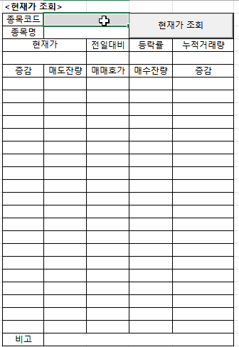

# My `xingAPI` Application Modules

Codes with `XingAPI` from **eBest Investment & Securities**


**\<Reference>**  
- xingAPI 홈페이지 ☞ https://www.ebestsec.co.kr/xingapi/xingMain.jsp  
- xingAPI 도움말 ☞ https://www.ebestsec.co.kr/apiguide/guide.jsp  
- xingAPI COM 개발가이드 ☞ https://www.ebestsec.co.kr/apiguide/guide.jsp?cno=200

**\<VBA>**  
- [Request Data : Current Price - T1101 2 (2021.11.22)]()
- [Request Data : Current Price - T1101 (2021.11.17)](/XingAPI#request-data--current-price---t1101-20211117)
- [Read Account List (2021.11.10)](/XingAPI#read-account-list-20211110)
- [Login 2 (2021.11.09)](/XingAPI#login-2-20211109)
- [Login 1 (2021.11.08)](/XingAPI#login-1-20211108)


## [Request Data : Current Price - T1101 2 (2021.11.22)](/XingAPI#my-xingapi-application-modules)

- advanced from [`T1101 1`](/XingAPI#request-data--current-price---t1101-20211117)
- add the **market category** of a stock through **t1102**
- load bid/offer data into an **array**
- imporve the time expression


```vba
Dim WithEvents XAQuery_t1101 As XAQuery         ' t1101 : 주식 현재가 호가 조회
Dim WithEvents XAQuery_t1102 As XAQuery         ' t1102 : 주식 현재가(시세) 조회 (※ 시장 구분)
```
```vba
' T1101 : Current Price without XAReal
Private Sub Request_t1101()

    If XAQuery_t1101 Is Nothing Then
        Set XAQuery_t1101 = CreateObject("XA_DataSet.XAQuery")                                  ' set XAQuery object
        XAQuery_t1101.ResFileName = "c:\\eBEST\xingAPI\Res\t1101.res"                           ' call related .res file
    End If

    Dim shcode As String
    shcode = Range("G3").Value
    Call XAQuery_t1101.SetFieldData("t1101InBlock", "shcode", 0, shcode)                        ' 0 : nOccursIndex, '0' 고정

    If XAQuery_t1101.Request(False) < 0 Then
        Range("H27") = "전송 오류(t1101)"
    End If

End Sub
```
```vba
Private Sub XAQuery_t1101_ReceiveData(ByVal szTrCode As String)

    ' The current price and other informations
    Range("H3") = XAQuery_t1101.GetFieldData("t1101OutBlock", "hname", 0)                       ' 종목명
    Range("G5") = XAQuery_t1101.GetFieldData("t1101OutBlock", "price", 0)                       ' 현재가
    Dim sSign As String
    sSign = GetSign(XAQuery_t1101.GetFieldData("t1101OutBlock", "sign", 0))                     ' 전일대비구분 (※ 별도 함수 GetSign() 정의 필요)
    Range("I5") = sSign & XAQuery_t1101.GetFieldData("t1101OutBlock", "change", 0)              ' 전일대비
    Range("J5") = XAQuery_t1101.GetFieldData("t1101OutBlock", "diff", 0) / 100                  ' 등락률
    Range("K5") = XAQuery_t1101.GetFieldData("t1101OutBlock", "volume", 0)                      ' (당일)누적거래량

    ' Bid/Offer prices and volumes through an array (faster)
    Dim arrHoga(20, 5), i As Integer
    For i = 1 To 10
        arrHoga(10 - i, 2) = XAQuery_t1101.GetFieldData("t1101OutBlock", "offerho" & i, 0)      ' 매도호가
        arrHoga(10 - i, 1) = XAQuery_t1101.GetFieldData("t1101OutBlock", "offerrem" & i, 0)     ' 매도호가수량
        arrHoga(10 - i, 0) = XAQuery_t1101.GetFieldData("t1101OutBlock", "preoffercha" & i, 0)  ' 직전매도대비수량
        arrHoga(9 + i, 2) = XAQuery_t1101.GetFieldData("t1101OutBlock", "bidho" & i, 0)         ' 매수호가
        arrHoga(9 + i, 3) = XAQuery_t1101.GetFieldData("t1101OutBlock", "bidrem" & i, 0)        ' 매수호가수량
        arrHoga(9 + i, 4) = XAQuery_t1101.GetFieldData("t1101OutBlock", "prebidcha" & i, 0)     ' 직전매수대비수량
    Next i
    Range("G7:K26").Value = arrHoga

    ' Receiving time
    Dim hotime As String
    hotime = XAQuery_t1101.GetFieldData("t1101OutBlock", "hotime", 0)
    Range("H27") = Left(hotime, 2) & ":" & Mid(hotime, 3, 2) & ":" & Mid(hotime, 5, 2) & ":" & Mid(hotime, 7, 2)

End Sub
```
```vba
' T1102 : Get the Market Categoty among KOSPI / KOSPI200 / KOSPI DR / KOSDAQ50 / KOSDAQ / CB
Private Sub Request_t1102()

    If XAQuery_t1102 Is Nothing Then
        Set XAQuery_t1102 = CreateObject("XA_DataSet.XAQuery")
        XAQuery_t1102.ResFileName = "c:\\eBEST\xingAPI\Res\t1102.res"
    End If

    Dim shcode As String
    shcode = Range("G3").Value
    Call XAQuery_t1102.SetFieldData("t1102InBlock", "shcode", 0, shcode)

    If XAQuery_t1102.Request(False) < 0 Then
        Range("H27") = "전송 오류(t1102)"
    End If

End Sub
```
```vba
Private Sub XAQuery_t1102_ReceiveData(ByVal szTrCode As String)

    Range("I3") = XAQuery_t1102.GetFieldData("t1102OutBlock", "janginfo", 0)                    ' 장구분 (※ from t1102)

End Sub
```
```vba
Private Function GetSign(ByVal sSign As String)

    Select Case sSign
        Case "1"
            GetSign = "↑"
        Case "2"
            GetSign = "▲"
        Case "4"
            GetSign = "↓"
        Case "5"
            GetSign = "▼"
        Case Else
            GetSign = ""
    End Select

End Function
```
```vba
Private Sub Worksheet_Change(ByVal Target As Range)

    If Not Intersect(Range("G3"), Target) Is Nothing Then
    ' If Target.Range("G3") Is changed Then                                                     ' doesn't work well
        Call btnRequestT1101_Click
    End If

End Sub
```
```vba
Private Sub btnRequestT1101_Click()

    Range("H3:I3") = ""
    Range("G5:K5") = ""
    Range("G7:K26") = ""
    Range("H27") = ""

    Call Request_t1101
    Call Request_t1102

End Sub
```


## [Request Data : Current Price - T1101 (2021.11.17)](/XingAPI#my-xingapi-application-modules)

- read a stock's current price information (**t1101**)




## [Read Account List (2021.11.10)](/XingAPI#my-xingapi-application-modules)

- read account list with using `XASession`


```vba
Dim WithEvents XASession_Account As XASession
```

```vba
' Read the account list
Private Sub readAccounts_Click()

    ' Initialize account list table
    ActiveSheet.Range("a9:b9") = ""
    ActiveSheet.Range("A11:E30") = ""

    Set XASession_Account = CreateObject("XA_Session.XASession")

    Dim nCnt As Integer, i As Integer, szAcct As String
    nCnt = XASession_Account.GetAccountListCount()                                  ' start from 0

    ' Output
    ActiveSheet.Cells(9, 1) = XASession_Account.GetServerName()
    ActiveSheet.Cells(9, 2) = nCnt
    
    For i = 0 To nCnt - 1
        szAcct = XASession_Account.GetAccountList(i)                                ' get each account number

        ActiveSheet.Cells(11 + i, 1) = i + 1
        ActiveSheet.Cells(11 + i, 2) = szAcct
        ActiveSheet.Cells(11 + i, 3) = XASession_Account.GetAccountName(szAcct)
        ActiveSheet.Cells(11 + i, 4) = XASession_Account.GetAcctDetailName(szAcct)  ' get account type
        ActiveSheet.Cells(11 + i, 5) = XASession_Account.GetAcctNickname(szAcct)

        If i >= 10 Then
            ActiveSheet.Cells(11 + i + 1, 2) = "계좌 수가 " & i & "개를 초과하였습니다."
            Exit Sub
        End If
    Next

End Sub
```


## [Login 2 (2021.11.09)](/XingAPI#my-xingapi-application-modules)

- advanced from [Login 1 (2021.11.08)](/XingAPI#login-1-20211108)
- enter login information on the Excel sheet, not on the `InputBox`
- can choose server type


```vba
Option Explicit                                                             ' Generate a compile-time error
```

```vba
Dim WithEvents XASession_Login As XASession                                 ' must be declared in the Excel object
```

```vba
' Login
Private Sub btnLogin_Click()

    ' Initialize status cells
    ActiveSheet.Cells(5, 2) = ""                                            ' .Clear : clear even cell form
    ActiveSheet.Cells(6, 2) = ""

    ' Determine server type
    Dim server As String
    If ActiveSheet.Cells(1, 2).Value = "실서버" Then
        server = "hts.ebestsec.co.kr"
    ElseIf ActiveSheet.Cells(1, 2).Value = "모의투자" Then
        server = "demo.ebestsec.co.kr"
    Else
        ActiveSheet.Cells(6, 2) = "서버를 지정해주세요 : 실서버 / 모의투자"
        Exit Sub
    End If

    Set XASession_Login = CreateObject("XA_Session.XASession")

    ' Connect server
    If XASession_Login.ConnectServer(server, 0) = False Then
        ActiveSheet.Cells(5, 2) = "서버 접속 실패"
    Else
        ActiveSheet.Cells(5, 2) = "서버 접속 성공"
    End If

    ' Enter ID, password and certificate password
    Dim ID, pwd, certPwd As String
        ID = ActiveSheet.Cells(2, 2).Value
        pwd = ActiveSheet.Cells(3, 2).Value
        certPwd = ActiveSheet.Cells(4, 2).Value

    ' Send login information
    If XASession_Login.Login(ID, pwd, certPwd, 0, False) = False Then
        ActiveSheet.Cells(5, 2) = "로그인정보 전송 실패"
    Else
        ActiveSheet.Cells(5, 2) = "로그인정보 전송 성공"
    End If

End Sub
```

```vba
' Check the result of login
Private Sub XASession_Login_Login(ByVal szCode As String, ByVal szMsg As String)

    Sheet2.Cells(6, 2) = szCode & " : " & szMsg

End Sub
```


## [Login 1 (2021.11.08)](/XingAPI#my-xingapi-application-modules)

- **the 1st trial** to build login process into `xingAPI` in **VBA**

