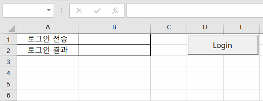

# XingAPI Application Modules

Codes with `XingAPI` from **eBest Investment & Securities**


**\<Reference>**  
&nbsp;- xingAPI 홈페이지 ☞ https://www.ebestsec.co.kr/xingapi/xingMain.jsp  
&nbsp;- xingAPI 도움말 ☞ https://www.ebestsec.co.kr/apiguide/guide.jsp  
&nbsp;- xingAPI COM 개발가이드 ☞ https://www.ebestsec.co.kr/apiguide/guide.jsp?cno=200

- [VBA : Login (2021.11.08)](/XingAPI#vba--login-20211108)


## [VBA : Login (2021.11.08)](/XingAPI#xingapi)

```VBA
Option Explicit                                                                     ' Generate a compile-time error
```

```VBA
Dim WithEvents XASession_Login As XASession                                         ' must be declared in the Excel object
```

```VBA
Private Sub btnLogin_Click()

    ' Initialize status cells
    Sheet1.Cells(1, 2) = ""                                                         ' .Clear : clear even cell form
    Sheet1.Cells(2, 2) = ""

    Set XASession_Login = CreateObject("XA_Session.XASession")

    ' Connect server
    If XASession_Login.ConnectServer("hts.ebestsec.co.kr", 0) = False Then
        MsgBox "Server connection has been failed."
    End If

    ' Enter ID, password and certificate password
    Dim ID, pwd, certPwd As String
        ID = InputBox("Enter your ID")
        pwd = InputBox("Enter your password")                                       ' need to mask the passwords
        certPwd = InputBox("Enter your certificate password")
        
    ' Send login information
    If XASession_Login.Login(ID, pwd, certPwd, 0, False) = False Then
        Sheet1.Cells(1, 2) = "Failed"
    Else
        Sheet1.Cells(1, 2) = "Successed"
    End If

End Sub
```

```VBA
' Check the result of login
Private Sub XASession_Login_Login(ByVal szCode As String, ByVal szMsg As String)

    Sheet1.Cells(2, 2) = szCode & " : " & szMsg

End Sub
```

