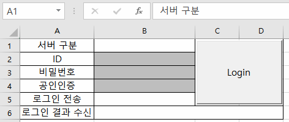

# My `xingAPI` Application Modules

Codes with `XingAPI` from **eBest Investment & Securities**


**\<Reference>**  
&nbsp;- xingAPI 홈페이지 ☞ https://www.ebestsec.co.kr/xingapi/xingMain.jsp  
&nbsp;- xingAPI 도움말 ☞ https://www.ebestsec.co.kr/apiguide/guide.jsp  
&nbsp;- xingAPI COM 개발가이드 ☞ https://www.ebestsec.co.kr/apiguide/guide.jsp?cno=200

- [VBA : Login 2 (2021.11.09)](/XingAPI#vba--login-2-20211109)
- [VBA : Login 1 (2021.11.08)](/XingAPI#vba--login-1-20211108)


## [VBA : Login 2 (2021.11.09)](/XingAPI#my-xingapi-application-modules)
- advanced from [VBA : Login 1 (2021.11.08)](/XingAPI#vba--login-1-20211108)
- enter login information on the Excel sheet, not on the `InputBox`
- can choose server type



```VBA
Option Explicit                                                                     ' Generate a compile-time error
```

```VBA
Dim WithEvents XASession_Login As XASession                                         ' must be declared in the Excel object
```

```VBA
Private Sub btnLogin_Click()

    ' Initialize status cells
    Sheet2.Cells(5, 2) = ""                                                         ' .Clear : clear even cell form
    Sheet2.Cells(6, 2) = ""

    Set XASession_Login = CreateObject("XA_Session.XASession")

    ' Determine server type
    Dim server As String
    If Sheet2.Cells(1, 2).Value = "실서버" Then
        server = "hts.ebestsec.co.kr"
    ElseIf Sheet2.Cells(1, 2).Value = "모의투자" Then
        server = "demo.ebestsec.co.kr"
    Else
        Sheet2.Cells(6, 2) = "서버를 지정해주세요 : 실서버 / 모의투자"
        Exit Sub
    End If
    
    ' Connect server
    If XASession_Login.ConnectServer(server, 0) = False Then
        Sheet2.Cells(6, 2) = "서버 접속 실패"
    End If

    ' Enter ID, password and certificate password
    Dim ID, pwd, certPwd As String
        ID = Sheet2.Cells(2, 2).Value
        pwd = Sheet2.Cells(3, 2).Value
        certPwd = Sheet2.Cells(4, 2).Value
        
    ' Send login information
    If XASession_Login.Login(ID, pwd, certPwd, 0, False) = False Then
        Sheet2.Cells(5, 2) = "로그인정보 전송 실패"
    Else
        Sheet2.Cells(5, 2) = "로그인정보 전송 성공"
    End If

End Sub
```

```VBA
' Check the result of login
Private Sub XASession_Login_Login(ByVal szCode As String, ByVal szMsg As String)

    Sheet2.Cells(6, 2) = szCode & " : " & szMsg

End Sub
```


## [VBA : Login 1 (2021.11.08)](/XingAPI#my-xingapi-application-modules)

- **the 1st trial** to build login process into `xingAPI` in **VBA**

