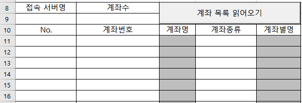

# My `xingAPI` Application Modules

Codes with `xingAPI` from **eBest Investment & Securities**


**\<Reference>**  
- xingAPI 홈페이지 ☞ https://www.ebestsec.co.kr/xingapi/xingMain.jsp  
- xingAPI 도움말 ☞ https://www.ebestsec.co.kr/apiguide/guide.jsp  
- xingAPI COM 개발가이드 ☞ https://www.ebestsec.co.kr/apiguide/guide.jsp?cno=200

**\<VBA>**
- [Current Price - T1101 2.1 (2022.06.17)](#current-price---t1101-21-20220617)
- [Current Price - T1101 2.0 (2021.11.23)](#current-price---t1101-20-20211123)
- [Current Price - T1101 1.1 (2021.11.22)](#current-price---t1101-11-20211122)
- [Current Price - T1101 1.0 (2021.11.17)](#current-price---t1101-10-20211117)
- [Read Account List 1.0 (2021.11.10)](#read-account-list-10-20211110)
- [Login 2.0 (2021.11.09)](#login-20-20211109)
- [Login 1.0 (2021.11.08)](#login-10-20211108)


## [Current Price - T1101 2.1 (2022.06.17)](#my-xingapi-application-modules)


## [Current Price - T1101 2 (2021.11.23)](#my-xingapi-application-modules)

- call **real time data** through `XAReal`; `_S3_` `_H1_` `_K3_` `_HA_`
- determine if the market category is *KOSPI* or *KOSDAQ* by `t1102`
- **consistentize** data from `t1101` with real time data  
&nbsp;- skip the outblock fields of `직전매도대비수량` `직전매수대비수량`  
&nbsp;- change the time expression to `HH:MM:SS` by skipping the last two digits
- **process flow** among objects :  
  &nbsp;(1) Worksheet_Change() *(※ can be skipped)*  
  → (2) btnRequestT1101_Click()  
  → (3) Request_t1101()  
  → (4) XAQuery_t1101_ReceiveData()  
  → (5) Request_t1102()  
  → (6) XAQuery_t1102_ReceiveData()  
  → (7) XAReal_S3/H1_ReceiveRealData() or XAReal_K3/HA_ReceiveRealData()


```vba
Dim WithEvents XAQuery_t1101 As XAQuery         ' t1101 : 주식 현재가 호가 조회
Dim WithEvents XAQuery_t1102 As XAQuery         ' t1102 : 주식 현재가(시세) 조회 (※ 시장 구분)

Dim WithEvents XAReal_S3_ As XAReal             ' S3 : KOSPI체결
Dim WithEvents XAReal_H1_ As XAReal             ' H1 : KOSPI호가잔량
Dim WithEvents XAReal_K3_ As XAReal             ' K3 : KOSDAQ체결
Dim WithEvents XAReal_HA_ As XAReal             ' HA : KOSDAQ호가잔량
```

```vba
' T1101 : Current Price with XAReal
' Request_t1101() → XAQuery_t1101_ReceiveData()
Private Sub Request_t1101()

    ' Reset cells on the excel sheet
    Range("H3:I3") = ""
    Range("G5:K5") = ""
    Range("G7:K26") = ""
    Range("H27") = ""

    ' Reset the formerly loaded XAReal objects
    If Not (XAReal_S3_ Is Nothing) Then Call XAReal_S3_.UnadviseRealData
    If Not (XAReal_H1_ Is Nothing) Then Call XAReal_H1_.UnadviseRealData
    If Not (XAReal_K3_ Is Nothing) Then Call XAReal_K3_.UnadviseRealData
    If Not (XAReal_HA_ Is Nothing) Then Call XAReal_HA_.UnadviseRealData

    ' Initialize a XAQuery object
    If XAQuery_t1101 Is Nothing Then
        Set XAQuery_t1101 = CreateObject("XA_DataSet.XAQuery")                                 ' set XAQuery object
        XAQuery_t1101.ResFileName = "c:\\eBEST\xingAPI\Res\t1101.res"                          ' call related .res file
    End If

    ' Read the stock hashcode
    Dim shcode As String
    shcode = Range("G3").Value
    Call XAQuery_t1101.SetFieldData("t1101InBlock", "shcode", 0, shcode)                       ' 0 : nOccursIndex, '0' 고정

    If XAQuery_t1101.Request(False) < 0 Then
        Range("H27") = "전송 오류"
    End If

End Sub
```

```vba
' Request_t1101() → XAQuery_t1101_ReceiveData() → Request_t1102()
Private Sub XAQuery_t1101_ReceiveData(ByVal szTrCode As String)

    ' The current price and other informations
    Range("H3") = XAQuery_t1101.GetFieldData("t1101OutBlock", "hname", 0)                           ' 종목명
    Range("G5") = XAQuery_t1101.GetFieldData("t1101OutBlock", "price", 0)                           ' 현재가
    Dim sSign As String
    sSign = GetSign(XAQuery_t1101.GetFieldData("t1101OutBlock", "sign", 0))                         ' 전일대비구분 (※ 별도 함수 GetSign() 정의 필요)
    Range("I5") = sSign & XAQuery_t1101.GetFieldData("t1101OutBlock", "change", 0)                  ' 전일대비
    Range("J5") = XAQuery_t1101.GetFieldData("t1101OutBlock", "diff", 0) / 100                      ' 등락률
    Range("K5") = XAQuery_t1101.GetFieldData("t1101OutBlock", "volume", 0)                          ' (당일)누적거래량

    ' Bid/Offer prices and volumes through an array (faster)
    Dim arrHoga(20, 5), i As Integer
    For i = 1 To 10
        arrHoga(10 - i, 2) = XAQuery_t1101.GetFieldData("t1101OutBlock", "offerho" & i, 0)          ' 매도호가
        arrHoga(10 - i, 1) = XAQuery_t1101.GetFieldData("t1101OutBlock", "offerrem" & i, 0)         ' 매도호가수량
        ' arrHoga(10 - i, 0) = XAQuery_t1101.GetFieldData("t1101OutBlock", "preoffercha" & i, 0)    ' 직전매도대비수량 : Real에서 미제공, 통일성을 위해 생략
        arrHoga(9 + i, 2) = XAQuery_t1101.GetFieldData("t1101OutBlock", "bidho" & i, 0)             ' 매수호가
        arrHoga(9 + i, 3) = XAQuery_t1101.GetFieldData("t1101OutBlock", "bidrem" & i, 0)            ' 매수호가수량
        ' arrHoga(9 + i, 4) = XAQuery_t1101.GetFieldData("t1101OutBlock", "prebidcha" & i, 0)       ' 직전매수대비수량 : Real에서 미제공, 통일성을 위해 생략
    Next i
    Range("G7:K26").Value = arrHoga

    ' Receiving time
    Dim hotime As String
    hotime = XAQuery_t1101.GetFieldData("t1101OutBlock", "hotime", 0)
    Range("H27") = Left(hotime, 2) & ":" & Mid(hotime, 3, 2) & ":" & Mid(hotime, 5, 2)              ' string(8) : Real에서 미제공, 통일성을 위해 [6~7] 생략

    Call Request_t1102

End Sub
```

```vba
' T1102 : Get the Market Categoty among KOSPI / KOSPI200 / KOSPI DR / KOSDAQ50 / KOSDAQ / CB
' XAQuery_t1101_ReceiveData() → Request_t1102() → XAQuery_t1102_ReceiveData()
Private Sub Request_t1102()

    If XAQuery_t1102 Is Nothing Then
        Set XAQuery_t1102 = CreateObject("XA_DataSet.XAQuery")
        XAQuery_t1102.ResFileName = "c:\\eBEST\xingAPI\Res\t1102.res"
    End If

    Dim shcode As String
    shcode = Range("G3").Value
    Call XAQuery_t1102.SetFieldData("t1102InBlock", "shcode", 0, shcode)

    If XAQuery_t1102.Request(False) < 0 Then
        Range("H27") = "전송 오류(t1102)"
    End If

End Sub
```

```vba
' Request_t1102() → XAQuery_t1102_ReceiveData() → XAReal_S3/H1_ReceiveRealData() or XAReal_K3/HA_ReceiveRealData()
Private Sub XAQuery_t1102_ReceiveData(ByVal szTrCode As String)

    ' Find the market category
    Dim janginfo As String
    janginfo = XAQuery_t1102.GetFieldData("t1102OutBlock", "janginfo", 0)               ' 장구분 : from t1102, string(10)
    Range("I3") = janginfo

    ' Determine if the market is KOSPI or KOSDAQ
    If Left(janginfo, 5) = "KOSPI" Then
    
        If XAReal_S3_ Is Nothing Then
            Set XAReal_S3_ = CreateObject("XA_DataSet.XAReal")
            XAReal_S3_.ResFileName = "c:\\eBEST\xingAPI\Res\S3_.res"
        End If
        Call XAReal_S3_.SetFieldData("InBlock", "shcode", Range("G3").Text)
        Call XAReal_S3_.AdviseRealData

        If XAReal_H1_ Is Nothing Then
            Set XAReal_H1_ = CreateObject("XA_DataSet.XAReal")
            XAReal_H1_.ResFileName = "c:\\eBEST\xingAPI\Res\H1_.res"
        End If
        Call XAReal_H1_.SetFieldData("InBlock", "shcode", Range("G3").Text)
        Call XAReal_H1_.AdviseRealData

    ElseIf Left(janginfo, 6) = "KOSDAQ" Then

        If XAReal_K3_ Is Nothing Then
            Set XAReal_K3_ = CreateObject("XA_DataSet.XAReal")
            XAReal_K3_.ResFileName = "c:\\eBEST\xingAPI\Res\K3_.res"
        End If
        Call XAReal_K3_.SetFieldData("InBlock", "shcode", Range("G3").Text)
        Call XAReal_K3_.AdviseRealData

        If XAReal_HA_ Is Nothing Then
            Set XAReal_HA_ = CreateObject("XA_DataSet.XAReal")
            XAReal_HA_.ResFileName = "c:\\eBEST\xingAPI\Res\HA_.res"
        End If
        Call XAReal_HA_.SetFieldData("InBlock", "shcode", Range("G3").Text)
        Call XAReal_HA_.AdviseRealData

    Else                                                                                ' Else case : "CB"

        Range("H27") = "CB 종목의 Real Data 수신이 불가합니다."

    End If

End Sub
```

```vba
' XAQuery_t1102_ReceiveData() → XAReal_S3/H1_ReceiveRealData() or XAReal_K3/HA_ReceiveRealData() ①
Private Sub XAReal_S3__ReceiveRealData(ByVal szTrCode As String)

    ' The current price and other informations
    Range("G5") = XAReal_S3_.GetFieldData("Outblock", "price")                          ' 현재가
    Dim sSign As String
    sSign = GetSign(XAReal_S3_.GetFieldData("Outblock", "sign"))                        ' 전일대비구분 (※ 별도 함수 GetSign() 정의 필요)
    Range("I5") = sSign & XAReal_S3_.GetFieldData("Outblock", "change")                 ' 전일대비
    Range("J5") = XAReal_S3_.GetFieldData("Outblock", "drate") / 100                    ' 등락률 : not "diff"
    Range("K5") = XAReal_S3_.GetFieldData("Outblock", "volume")                         ' (당일)누적거래량

End Sub
```

```vba
' XAQuery_t1102_ReceiveData() → XAReal_S3/H1_ReceiveRealData() or XAReal_K3/HA_ReceiveRealData() ②
Private Sub XAReal_H1__ReceiveRealData(ByVal szTrCode As String)

    ' Bid/Offer prices and volumes through an array (faster)
    Dim arrHoga(20, 5), i As Integer
    For i = 1 To 10
        arrHoga(10 - i, 2) = XAReal_H1_.GetFieldData("Outblock", "offerho" & i)         ' 매도호가
        arrHoga(10 - i, 1) = XAReal_H1_.GetFieldData("Outblock", "offerrem" & i)        ' 매도호가수량
        arrHoga(9 + i, 2) = XAReal_H1_.GetFieldData("Outblock", "bidho" & i)            ' 매수호가
        arrHoga(9 + i, 3) = XAReal_H1_.GetFieldData("Outblock", "bidrem" & i)           ' 매수호가수량
    Next i
    Range("G7:K26").Value = arrHoga

    ' Receiving time
    Dim hotime As String
    hotime = XAReal_H1_.GetFieldData("Outblock", "hotime")
    Range("H27") = Left(hotime, 2) & ":" & Mid(hotime, 3, 2) & ":" & Mid(hotime, 5, 2)  ' string(6)

End Sub
```

```vba
' XAQuery_t1102_ReceiveData() → XAReal_S3/H1_ReceiveRealData() or XAReal_K3/HA_ReceiveRealData() ③
Private Sub XAReal_K3__ReceiveRealData(ByVal szTrCode As String)

    ' The current price and other informations
    Range("G5") = XAReal_K3_.GetFieldData("Outblock", "price")                          ' 현재가
    Dim sSign As String
    sSign = GetSign(XAReal_K3_.GetFieldData("Outblock", "sign"))                        ' 전일대비구분 (※ 별도 함수 GetSign() 정의 필요)
    Range("I5") = sSign & XAReal_K3_.GetFieldData("Outblock", "change")                 ' 전일대비
    Range("J5") = XAReal_K3_.GetFieldData("Outblock", "drate") / 100                    ' 등락률 : not "diff"
    Range("K5") = XAReal_K3_.GetFieldData("Outblock", "volume")                         ' (당일)누적거래량

End Sub
```

```vba
' XAQuery_t1102_ReceiveData() → XAReal_S3/H1_ReceiveRealData() or XAReal_K3/HA_ReceiveRealData() ④
Private Sub XAReal_HA__ReceiveRealData(ByVal szTrCode As String)

    ' Bid/Offer prices and volumes through an array (faster)
    Dim arrHoga(20, 5), i As Integer
    For i = 1 To 10
        arrHoga(10 - i, 2) = XAReal_HA_.GetFieldData("Outblock", "offerho" & i)         ' 매도호가
        arrHoga(10 - i, 1) = XAReal_HA_.GetFieldData("Outblock", "offerrem" & i)        ' 매도호가수량
        arrHoga(9 + i, 2) = XAReal_HA_.GetFieldData("Outblock", "bidho" & i)            ' 매수호가
        arrHoga(9 + i, 3) = XAReal_HA_.GetFieldData("Outblock", "bidrem" & i)           ' 매수호가수량
    Next i
    Range("G7:K26").Value = arrHoga

    ' Receiving time
    Dim hotime As String
    hotime = XAReal_HA_.GetFieldData("Outblock", "hotime")
    Range("H27") = Left(hotime, 2) & ":" & Mid(hotime, 3, 2) & ":" & Mid(hotime, 5, 2)  ' string(6)

End Sub
```

```vba
' Used in XAQuery_t1101_ReceiveData(), XAReal_S3_ReceiveRealData(), XAReal_K3_ReceiveRealData()
Private Function GetSign(ByVal sSign As String)

    Select Case sSign
        Case "1"
            GetSign = "↑"
        Case "2"
            GetSign = "▲"
        Case "4"
            GetSign = "↓"
        Case "5"
            GetSign = "▼"
        Case Else
            GetSign = ""
    End Select

End Function
```

```vba
' Watch changes on the Excel sheet
' Worksheet_Change() → btnRequestT1101_Click()
Private Sub Worksheet_Change(ByVal Target As Range)

    If Not Intersect(Range("G3"), Target) Is Nothing Then
    ' If Target.Range("G3") Is changed Then                                             ' doesn't work well
        Call btnRequestT1101_Click
    End If

End Sub
```

```vba
' Run when btnRequestT1101 is clicked
' Worksheet_Change() → btnRequestT1101_Click() → Request_t1101()
Private Sub btnRequestT1101_Click()

    Call Request_t1101

End Sub
```


## [Current Price - T1101 1.1 (2021.11.22)](my-xingapi-application-modules)

- advanced from [T1101 1.0 (2021.11.17)](request-data--current-price---t1101-10-20211117)
- add the **market category** of a stock through `t1102`
- load bid/offer data into an **array**
- imporve the time expression (`HH:MM:SS`)
- skip `ActiveSheet.` (※ including all the previously uploaded codes)


## [Current Price - T1101 1.0 (2021.11.17)](my-xingapi-application-modules)

- read a stock's current price information (**t1101**)


## [Read Account List 1.0 (2021.11.10)](my-xingapi-application-modules)

- read account list with using `XASession`
- ※ skip `ActiveSheet.` (2021.11.22)



```vba
Dim WithEvents XASession_Account As XASession
```

```vba
' Read the account list
Private Sub btnReadAccounts_Click()

    ' Initialize account list table
    Range("a9:b9") = ""
    Range("A11:E30") = ""

    Set XASession_Account = CreateObject("XA_Session.XASession")

    Dim nCnt As Integer, i As Integer, szAcct As String
    nCnt = XASession_Account.GetAccountListCount()                          ' start from 0
    
    ' Output
    Cells(9, 1) = XASession_Account.GetServerName()
    Cells(9, 2) = nCnt

    For i = 0 To nCnt - 1
        szAcct = XASession_Account.GetAccountList(i)                        ' get each account number

        Cells(11 + i, 1) = i + 1
        Cells(11 + i, 2) = szAcct
        Cells(11 + i, 3) = XASession_Account.GetAccountName(szAcct)
        Cells(11 + i, 4) = XASession_Account.GetAcctDetailName(szAcct)      ' get account type
        Cells(11 + i, 5) = XASession_Account.GetAcctNickname(szAcct)

        If i >= 10 Then
            Cells(11 + i + 1, 2) = "계좌 수가 " & i & "개를 초과하였습니다."
            Exit Sub
        End If
    Next

End Sub
```


## [Login 2.0 (2021.11.09)](my-xingapi-application-modules)

- advanced from [Login 1.0 (2021.11.08)](login-10-20211108)
- enter login information on the Excel sheet, not on the `InputBox`
- can choose server type
- ※ skip `ActiveSheet.` (2021.11.22)


```vba
Option Explicit                                                             ' Generate a compile-time error
```

```vba
Dim WithEvents XASession_Login As XASession                                 ' must be declared in the Excel object
```

```vba
' Login
Private Sub btnLogin_Click()

    ' Initialize status cells
    Cells(5, 2) = ""                                                        ' .Clear : clear even cell form
    Cells(6, 2) = ""

    ' Determine server type
    Dim server As String
    If Cells(1, 2).Value = "실서버" Then
        server = "hts.ebestsec.co.kr"
    ElseIf Cells(1, 2).Value = "모의투자" Then
        server = "demo.ebestsec.co.kr"
    Else
        Cells(6, 2) = "서버를 지정해주세요 : 실서버 / 모의투자"
        Exit Sub
    End If

    Set XASession_Login = CreateObject("XA_Session.XASession")

    ' Connect server
    If XASession_Login.ConnectServer(server, 0) = False Then
        Cells(5, 2) = "서버 접속 실패"
    Else
        Cells(5, 2) = "서버 접속 성공"
    End If

    ' Enter ID, password and certificate password
    Dim ID, pwd, certPwd As String
        ID = Cells(2, 2).Value
        pwd = Cells(3, 2).Value
        certPwd = Cells(4, 2).Value

    ' Send login information
    If XASession_Login.Login(ID, pwd, certPwd, 0, False) = False Then
        Cells(5, 2) = "로그인정보 전송 실패"
    Else
        Cells(5, 2) = "로그인정보 전송 성공"
    End If

End Sub
```

```vba
' Check the result of login
Private Sub XASession_Login_Login(ByVal szCode As String, ByVal szMsg As String)

    Cells(6, 2) = szCode & " : " & szMsg

End Sub
```


## [Login 1.0 (2021.11.08)](my-xingapi-application-modules)

- **the 1st trial** to build login process into `xingAPI` in **VBA**

