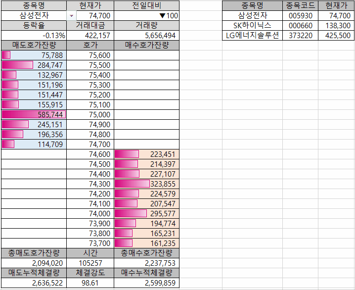

# [My `eBest` DDE Application Modules](../README.md#ebest-dde)

**Excel VBA** Code with **DDE** from *eBest Investment & Securities Co., Ltd.*


### \<List>
- [Real-time Current Price Data with DDE (2023.12.21)](#real-time-current-price-data-with-dde-20231221)


## [Real-time Current Price Data with DDE (2023.12.21)](#list)

- Practice DDE and VBA integration to maximize productivity

  

- Receive real-time information about the current price and remaining orders for the selected stock
  - The range of selectable stocks can be expanded by adding stock code data
- Improvements
  - Resolve the issue of temporarily displaying #N/A when the stock is changed
  - Change the time display format: hhmmss -> `hh:mm:ss'
  - Insert a comma for thousands in the change rate
- Code
  <details>
    <summary>Code : DDE_CurrentPrice.bas</summary>

  ```vba
  Option Explicit
  ```
  ```vba
  '현재가 박스의 영점 좌표를 반환합니다.
  '★ 현재가 박스의 위치 변경시 수정이 필요합니다.
  Private Function GetStartCell() As Range

      Set GetStartCell = Range("B4")                          ' B4 : 종목명 입력 위치

  End Function
  ```
  ```vba
  '주식의 종목코드와 종목명 등을 포함하는 코드테이블을 반환합니다.
  '★ 원본 데이터 위치 및 범위 변경시 수정이 필요합니다.
  Private Function GetCodeTable() As Range

      Dim codeTable       As Range
      Dim tableZeroPoint  As Range
      Dim tableRow        As Integer

      Set tableZeroPoint = Range("F4")
      tableRow = Range(tableZeroPoint, tableZeroPoint.End(xlDown)).Count
      Set codeTable = Range(tableZeroPoint, tableZeroPoint.Cells(tableRow, 3))
      Debug.Print "codeTable  : " & codeTable.Address         'Ok

      Set GetCodeTable = codeTable

  End Function
  ```
  ```vba
  '시작 셀(startCell)로부터 종료 셀(endCell)까지의 범위에서
  'DDE 호출 함수의 대상 종목코드를 변경합니다.
  Private Sub ReplaceText(ByRef startCell As Range)

      Dim priceTable      As Range
      Dim findText        As String
      Dim newText         As String

      '시작 셀과 끝 셀을 지정합니다.
      Set priceTable = Range(startCell, startCell.Cells(28, 3))
      Debug.Print "priceTable : " & priceTable.Address        'Ok

      '찾을 문자열을 지정합니다.

      findText = Mid(startCell.Offset(0, 1).Formula, 19, 6)
      Debug.Print "findText   : " & findText                  'Ok

      '바꿀 문자열을 지정합니다.
      newText = Application.WorksheetFunction.VLookup(startCell, GetCodeTable, 2, False)
      Debug.Print "newText    : " & newText                   'Ok

      '텍스트를 바꿉니다.
      Dim cell            As Range
      onChangingFlag = True
      For Each cell In priceTable
          'Debug.Print "cell : " & cell.Address               'Ok
          cell.Formula = Replace(cell.Formula, findText, newText)
      Next cell
      onChangingFlag = False

      Debug.Print ""

  End Sub
  ```
  ```vba
  '셀의 변경이 발생하면 해당 셀을 기준으로 현재가를 바꿉니다.
  Private Sub Worksheet_Change(ByVal Target As Range)

      If (onChangingFlag = False) Then

          Dim startCell   As Range

          Set startCell = GetStartCell()
          Debug.Print "startCell  : " & startCell.Address     'Ok

          If (Not Intersect(startCell, Target) Is Nothing) Then
              Call ReplaceText(startCell)
          End If
      
      End If

  End Sub
  ```
  </details>